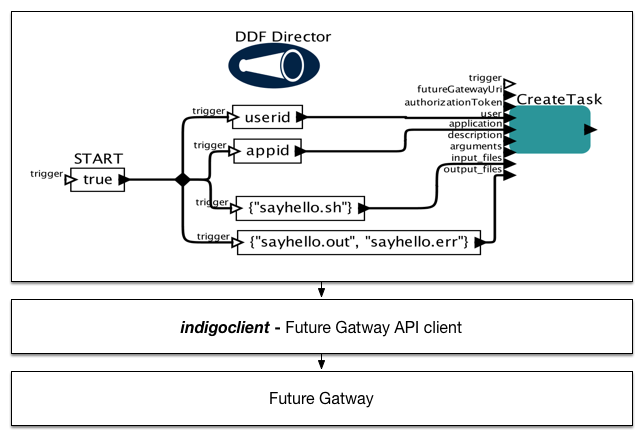

# Kepler
The Kepler Project is dedicated to furthering and supporting the capabilities, use, and awareness of the free and open source, scientific workflow application - Kepler. Kepler is designed to help scientists, analysts, and computer programmers create, execute, and share models and analyses across a broad range of scientific and engineering disciplines.

Each, individual, action inside Kepler is realised by so called - actors. Each actor provides functionality implemented by developer. It can be treated as black box. It reads inputs, performs calculations, and produce output.

# indigokepler
indigokepler provides set of actors that can be imported into Kepler. These actors provide access to Future Gateway. This way, Kepler users are able to access resources provided by Indigo-DC infrastructure. Actors developed in this project encapsulate Java based API for Future Gateway. It is developed in parallel. Java based API is developed in separate project&nbsp;[indigoclient](https://www.gitbook.com/book/indigo-dc/indigoclient).

Once imported to Kepler, Indigo-DC based actors provide components that allow building workflows that run on top of Indigo-DC infrastructure.

You can take a look at live demo of Kepler with Indigo-DC actors at following link: [demo](https://youtu.be/wiLHBdxu86E)

# Actors

All actors available via indigokepler project are described in chapter [Actors](docs/actors.md)

# Workflows

Information regarding building workflows can be found in chapter [Building workflows](docs/BuildingWorkflows.md)

# How to build Indigo-DC actors
You need to build indigoclient before you can proceed with building indigokepler project.

Make sure to take a look at:

https://github.com/indigo-dc/indigoclient

After you have built and published jars from indigoclient, you can build indigokepler

	mvn initialize  # this command will install ptolemy-lepler-2.5.jar in your local repository
	mvn install     # this command will build Kepler actors. Before proceeding, make sure you have build indigoclient (https://github.com/indigo-dc/indigoclient)
	mvn dependency:copy-dependencies -DoutputDirectory=target/indigo/lib/jar -DexcludeArtifactIds=ptolemy # installs all dependencies apart ptolemy

After building indigo module, directory structure should have following layout

    indigo/
    |-- lib
    |   |-- exe/
    |   `-- jar/
    |-- lib64/
    |-- module-info/
    |-- resources
    |   `-- system.properties/
    `-- src
        `-- pl
            `-- psnc
                `-- indigo
                    `-- fg
                        `-- kepler/

Copy whole directory into $KEPLER/ where $KEPLER points to your Kepler installation

Then, make sure to add "indigo" module into (simply add name of module into list of other modules) 

        kepler/build-area
        | 
        `-- modules.txt
    
* You can now compile and run Kepler 2.5

        cd kepler/build-area
        ant compile
        ant run

# ptolemy license

Below is the copyright agreement for the Ptolemy II system.

Copyright (c) 1995-2010 The Regents of the University of California. All rights reserved.

Permission is hereby granted, without written agreement and without license or royalty fees, to use, copy, modify, and distribute this software and its documentation for any purpose, provided that the above copyright notice and the following two paragraphs appear in all copies of this software.

IN NO EVENT SHALL THE UNIVERSITY OF CALIFORNIA BE LIABLE TO ANY PARTY FOR DIRECT, INDIRECT, SPECIAL, INCIDENTAL, OR CONSEQUENTIAL DAMAGES ARISING OUT OF THE USE OF THIS SOFTWARE AND ITS DOCUMENTATION, EVEN IF THE UNIVERSITY OF CALIFORNIA HAS BEEN ADVISED OF THE POSSIBILITY OF SUCH DAMAGE.

THE UNIVERSITY OF CALIFORNIA SPECIFICALLY DISCLAIMS ANY WARRANTIES, INCLUDING, BUT NOT LIMITED TO, THE IMPLIED WARRANTIES OF MERCHANTABILITY AND FITNESS FOR A PARTICULAR PURPOSE. THE SOFTWARE PROVIDED HEREUNDER IS ON AN "AS IS" BASIS, AND THE UNIVERSITY OF CALIFORNIA HAS NO OBLIGATION TO PROVIDE MAINTENANCE, SUPPORT, UPDATES, ENHANCEMENTS, OR MODIFICATIONS.
