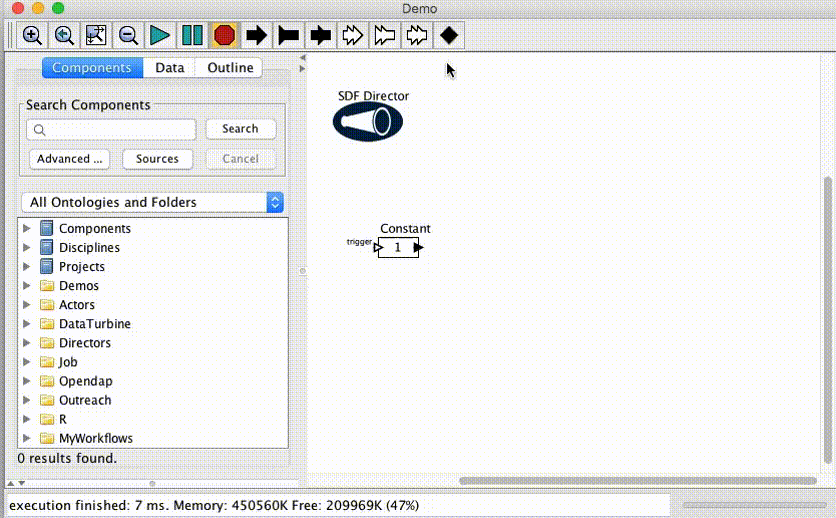

# Building workflows

Kepler provides GUI based application that can be used for building workflows. Building workflow is as easy as dragging and dropping actors on canvas and connecting each other. By making connections between actors one defines data flow in the workflow.

If you want to get familiar with Kepler and it's basics we strongly encourage you to take our free tutorial that is available here: [Kepler tutorial](http://scilla.man.poznan.pl:8080/confluence/display/euforia/Introduction+to+Kepler+-+basics)