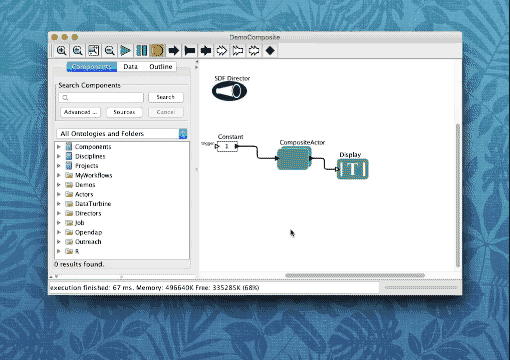

# Composite actors

Composite actors can embed multiple actors or even whole workflows. This way, it is possible to reduce size of the workflow by splitting it into smaller chunks.

Creating composite actors is as simple as putting special actor on canvas.

You can read more about building composite actors at following location: [Composite actor based loop](http://scilla.man.poznan.pl:8080/confluence/display/euforia/Introduction+to+Kepler+-+basics#IntroductiontoKepler-basics-3.6Executingadvancedloopworkflow%28CompositeloopRepeat%29) 