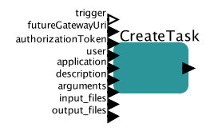

# Create task

This actor allows to create task with specified arguments

## CreateTask

### Inputs

* trigger - this port can be used to control execution of the actor
* futureGatewayURI - address of Future Gateway installation
* authorizationToken - user's token for authorization
* user - name of the user we are interested in
* application - ID of the application we want to run
* description - User friendly description of the task
* arguments - Arguments required by application
* input_files - List of all input files required to run job (these are local files; local in terms of Kepler location)
* output_files - List of files that will be created by application submitted to Future Gateway

### Outputs 

* output - JSON based output with task description