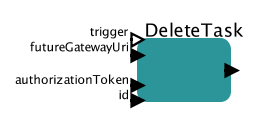

# Delete task

Removes task from Future Gateway's list of tasks

## DeleteTask

### Inputs

* trigger - this port can be used to control execution of the actor
* futureGatewayURI - address of Future Gateway installation
* authorizationToken - user's token for authorization
* id - ID of the task to be removed

### Outputs 

* output - JSON based output with task description