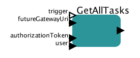

# Getting tasks list

This actor allows to retrieve all tasks submitted by user

## GetAllTasks

### Inputs

* trigger - this port can be used to control execution of the actor
* futureGatewayURI - address of Future Gateway installation
* authorizationToken - user's token for authorization
* user - name of the user we are interested in

### Outputs 

* output - JSON based output with all the tasks submitted by user