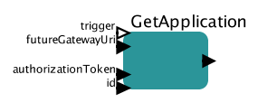

# Get application

Retrieves information regarding specified application.

## GetApplication

### Inputs

* trigger - this port can be used to control execution of the actor
* futureGatewayURI - address of Future Gateway installation
* authorizationToken - user's token for authorization
* id - ID of the application to be queried

### Outputs 

* output - JSON based description of application

It is possible to retrieve all the applications using [GetAllApplications](docs/actors/GetAllApplications.md) actor.

