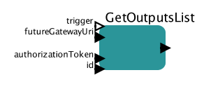

# Get outputs list

Retrieves information regarding all the outputs generated by task. These outputs can be downloaded using [DownloadFiles](docs/actors/DownloadFiles.md) actor.

## GetOutputsList

### Inputs

* trigger - this port can be used to control execution of the actor
* futureGatewayURI - address of Future Gateway installation
* authorizationToken - user's token for authorization
* id - ID of the task to be queried

### Outputs 

* output - JSON based list of files produced by task

