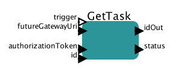

# Get task

Retrieves information regarding given task

## GetTask

### Inputs

* trigger - this port can be used to control execution of the actor
* futureGatewayURI - address of Future Gateway installation
* authorizationToken - user's token for authorization
* id - ID of the task to be queried

### Outputs 

* output - JSON based output with task description

Task Description constains information regarding task type, status, input files, output files.