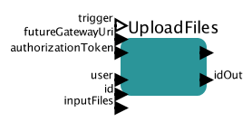

# Upload files

Uploads files required by task.

## UploadFiles

### Inputs

* trigger - this port can be used to control execution of the actor
* futureGatewayURI - address of Future Gateway installation
* authorizationToken - user's token for authorization
* user - user uploading files
* id - ID of the task files will be uploaded for
* inputFiles - list of files to be uploaded (local files)

### Outputs 

* output - JSON based description of task after files have been uploaded