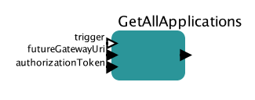

# Getting applications list

This actor allows to retrieve all the applications available in Future Gateway installation

## GetAllApplications

### Inputs

* trigger - this port can be used to control execution of the actor
* futureGatewayURI - address of Future Gateway installation
* authorizationToken - user's token for authorization

### Outputs 

* output - JSON based output with all the applications available in Future Gateway installation

